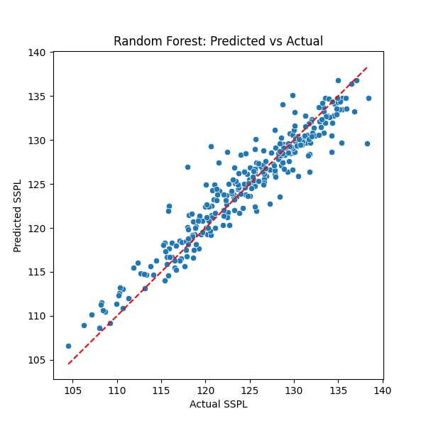
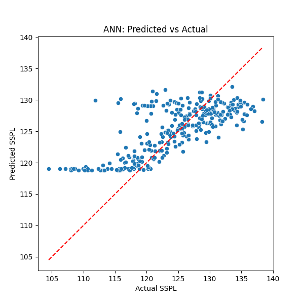

# Airfoil Self-Noise Prediction using AI
💡 Tip: If GitHub is experiencing background rendering issues displaying the .ipynb notebook file, you can view the full project code, charts, and analysis cleanly via this external viewer link:

👉 https://nbviewer.org/github/ZainShah740/engineering-ai-applications/blob/main/airfoil-self-noise-prediction/airfoil_self_noise_prediction.ipynb

This project focuses on predicting airfoil self-noise using machine learning models, combining AI with engineering simulation insights. The goal is to provide engineers with a fast, reliable tool to estimate aerodynamic noise, reducing reliance on costly simulations and enabling design optimization.

## How It Works

**Dataset:** NASA Airfoil Self-Noise Dataset included in this project folder `airfoilselfnoise.csv`
- Includes airfoil geometry and flow parameters with noise measurements.  
- Cleaned and preprocessed to ensure reliable training.

### Exploratory Data Analysis (EDA)

- Checked dataset shape and feature distributions  
- Explored skewness, outliers, and target 
- Analyzed feature correlations to identify dependencies  

### Preprocessing

- Renamed columns for clarity  
- Applied log-transformations to reduce skewness  
- Scaled features for model compatibility  
- Pipeline created for Random Forest to ensure scalability and production readiness  
- ANN uses a custom dataset loader and class definition for training

## Modeling

**Models Trained:**

1. **Random Forest (RF)**
   - Scalable pipeline using Column Transformers  
   - Hyperparameter tuned for optimal performance  
   - Trained on processed tabular dataset  

2. **Artificial Neural Network (ANN)**
   - Custom dataset loader and class-based model  
   - Trained for 100 epochs  
   - Architecture includes hidden layers  

### Model Evaluation

| Model           | R²      | MSE    | RMSE   | MAE    | Engineering Suitability |
|-----------------|---------|--------|--------|--------|------------------------|
| Random Forest   | 0.90+   | 4.62   | 2.15   | 1.57   | ✅ Preferred for deployment, stable, interpretable |
| ANN             | 0.50    | 25.06  | 5.01   | 3.82   | ❌ Not suitable for small tabular dataset |

### Key Insights

- **Model Selection Matters:** Tabular engineering data favors tree-based models like Random Forest over ANN for reliability and accuracy.  
- **Engineering Impact:** Random Forest predictions can accelerate noise estimation for airfoil design, potentially reducing reliance on expensive simulations.  
- **Decision Rationale:** Despite testing ANN, Random Forest is chosen due to higher performance, lower error, and practical engineering applicability.

## Visualization

Side-by-side comparison of predicted vs actual for both models:

  
  

> 🔑 This demonstrates the full engineering AI workflow: data acquisition → preprocessing → model training → evaluation → informed decision-making.

## What I Achieved

- Random Forest achieved **R² > 0.90**, stable and interpretable predictions  
- ANN achieved **R² ~ 0.50**, highlighting limitations on small tabular datasets  
- Learned practical AI application in an engineering context, combining **data science with aerodynamics knowledge**  

## Future Steps

- Convert the pipeline into a **full-fledged app**  
- Integrate front-end visualization for engineers to interact with predictions  
- Expand dataset to include additional airfoil geometries and flow conditions  
- Explore hybrid models to further improve predictive performance  

## Setup

1. Clone the repo: git clone https://github.com/ZainShah740/engineering-ai-applications.git
2. Move into the project folder: cd /airfoil-self-noise-prediction
3. Install dependencies: pip install -r requirements.txt
4. Open airfoil_self_noise_prediction.ipynb in Jupyter to explore the full workflow.

## 🤝Connect for Collaboration
Open to discussions on AI, engineering simulations, or joint projects—let’s create impactful solutions!

- <a href="https://www.linkedin.com/in/zain-shah-871aa532a">
     LinkedIn
  </a>

- <a href="https://x.com/zainshah_x">
     Twitter (X)
  </a>

- <a href="mailto:btenmeten12345@gmail.com">
     Gmail
  </a>

⭐ Star if useful, and check my profile for more projects!
