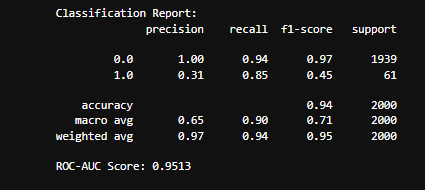

# Predictive Maintenance using Artificial Neural Network (ANN)

This project focuses on predictive maintenance for industrial machinery using an Artificial Neural Network (ANN). The goal is to proactively identify potential machine failures based on operational sensor data, enabling timely maintenance and reducing unplanned downtime.

## How It Works

**Dataset:** `predictive_maintenance.csv` included in this project folder  
- Contains operational parameters: air temperature, process temperature, rotational speed, torque, tool wear, machine type, and machine failure status  
- Cleaned and preprocessed for reliable ANN training  

### Exploratory Data Analysis (EDA)

- Checked dataset shape and feature distributions  
- Examined skewness and outliers for all input features  
- Analyzed feature correlations with the target (machine_failure)  
- Identified class imbalance in the target (0 → 9661, 1 → 339)  

### Preprocessing

- Scaled numeric features (`air_temp`, `process_temp`, `rotational_speed`, `torque`, `tool_wear_min`)  
- Label encoded categorical feature (`type`)  
- Ensured input consistency for ANN without pipeline (custom preprocessing function)  

## Modeling

**Model Trained:**  

1. **Artificial Neural Network (ANN)**
   - Single, custom-built ANN architecture  
   - Trained for 100 epochs on preprocessed data  
   - Handles imbalanced classes through weighted loss during training  
   - Outputs passed through sigmoid activation for probability prediction  

### Model Evaluation

The ANN achieved **93% accuracy** with **ROC-AUC 0.968**, capturing rare machine failures effectively.

### Key Insights

- **Imbalance-aware ANN:** Weighted loss allowed the model to capture rare failure events  
- **Outlier robustness:** ANN successfully handled features with outliers without explicit clipping  
- **Real-world relevance:** Enables predictive maintenance to reduce downtime and optimize operational efficiency  

## Visualization

**Class Report + ROC-AUC Snapshot:**  

  

> 🔑 This shows the full predictive maintenance workflow: data preprocessing → ANN training → evaluation → actionable predictions.

## What I Achieved

- Developed a **single ANN model** capable of detecting rare machine failures  
- Achieved **93.75% overall accuracy** with ROC-AUC **0.968**, highlighting strong predictive capability  
- Built experience in handling **imbalanced industrial datasets** and **custom preprocessing for ANN**  
- Gained practical knowledge in applying AI for **real-world engineering predictive maintenance**  

## Future Steps

- Expand the dataset to include more operational conditions and machinery  
- Convert preprocessing and ANN into a **production-ready class** for real-time predictions  
- Implement dashboard for **visual monitoring of machine health**  
- Experiment with hybrid models or ensemble methods for further accuracy improvement  

## Setup

1. Clone the repo: `git clone https://github.com/ZainShah740/engineering-ai-applications.git`  
2. Move into the project folder: `cd /industrial_machine_failure_prediction`  
3. Install dependencies: `pip install -r requirements.txt`  
4. Open `industrial_predictive_maintenance_ann.ipynb` in Jupyter to explore the full workflow  

## 🤝 Connect for Collaboration

Open to discussions on AI, predictive maintenance, or industrial projects—let’s create impactful solutions!

- <a href="https://www.linkedin.com/in/zain-shah-871aa532a">
     LinkedIn
  </a>

- <a href="https://x.com/zainshah_x">
     Twitter (X)
  </a>

- <a href="mailto:btenmeten12345@gmail.com">
     Gmail
  </a>

⭐ Star if useful, and check my profile for more projects!